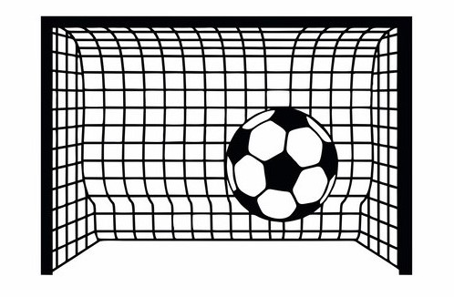

---
# https://github.com/henriquepgomide/caRtola
# [1]H. Gomide e A. Gualberto, CaRtola: Extração de dados da API do CartolaFC, análise exploratória dos dados e modelos preditivos em R e Python. https://github.com/henriquepgomide/caRtola/. 2020.

title: "Futebol Dashoboard"
output: 
  flexdashboard::flex_dashboard:
    logo: figure/logo_isolado_cdnaep_v00.png
    css: style.css
    orientation: columns
    vertical_layout: fill
    
---

```{r setup, include=FALSE}

#Carregar as bibliotecas
library(flexdashboard)
library(dplyr)
library(echarts4r)
library(readr)
library(ggplot2)
library(GGally)

#Carregar o arquivo de dados atraves da importacao
 dados_agregados_limpos <- read_csv("dados/dados_agregados_limpos.csv", 
    col_types = cols(AtletaID = col_character()))
 
 #Filtrando dados
 #O comando pipe (%>%) permite o acesso à estrutura da variável atraves da 
 #função que vem em seguida (no caso, filter)
 #O comando (%in%) acessa o vetor cujos registros sejam "Bahia" e "Vitória"
 
 dados <- dados_agregados_limpos %>% 
   filter(ClubeID %in% c('Bahia', 'Vitória') ) %>%
   filter(ano == 2017) %>% 
   group_by(AtletaID, Apelido, ClubeID, Posicao) %>% 
   summarise(Gtotal= sum(G), faltasCometidas = sum(FC), faltasSofridas = sum(FS),     passesErrados = sum(PE), roubosBola = sum(RB), .groups = 'drop')

```

<!-- Column {data-width=200} -->
<!-- ------------------------------------- -->

<!-- ### Inscritos - Cor/Raça Preta ou Parda  2016 -->
<!-- ```{r} -->
<!-- insc <- educacao_enem_estudantes_cor_2015_2019 %>% filter(year(ANO) %in% c(2016)) %>% filter(COR %in% c('Preta','Parda')) %>% summarise(valor=sum(FA)) %>% as_tibble() -->
<!-- valueBox(insc, icon = "fa-pencil",href="#concluintes-f", -->
<!--          color = "#7faed2") --> 
<!-- ``` -->

<!-- ### Inscritos - Cor/Raça Preta ou Parda 2019 -->
<!-- ```{r} -->
<!-- inscr <- educacao_enem_estudantes_cor_2015_2019 %>% filter(year(ANO) %in% c(2019)) %>% filter(COR %in% c('Preta','Parda')) %>% summarise(valor=sum(FA)) %>% as_tibble() -->
<!--   valueBox(inscr, icon = "fa-pencil", href="#concluintes-m",color='#4a82a8') -->
<!-- ``` -->

<!-- ### **Tema:** Cultura e Esportes -->

<!-- ```{r} -->
<!--  -->
<!-- ```  -->


<!-- Column {.tabset} -->
<!-- ----------------------------------------------------------------------- -->
<!-- o Column {.tabset} é o comando que divide o dashboard em colunas como tabela -->

Gols totais vs. Faltas cometidas {data-navmenu="Menu"}
=====================================

### <font size="5"> Gols totais vs. Faltas cometidas </font> {#gtfc}

```{r}

 dados %>% group_by(Posicao) %>%
    e_charts(Gtotal) %>% #eixo 0x
    e_scatter(faltasCometidas, symbol_size = 15) %>% #eixo 0y + tam do circulo
    e_color(c('#175676','#4189AF','#83B1D5','#FDD168',
              '#A094E1','#87A5B5'),"#ffffff")  %>%
    e_toolbox_feature(feature = "dataView",title = "Ver dados")%>%
    e_tooltip(trigger="axis", axisPointer = list(type = "cross"),
           textStyle = list(fontFamily="arial", fontSize=12)) %>%
    e_toolbox_feature(feature = "dataZoom")


```

Bolas roubadas vs. Faltas cometidas {data-navmenu="Menu"}
=====================================

### <font size="5"> Bolas roubadas vs. Faltas cometidas  </font> {#brfc}

```{r}

dados %>% group_by(Posicao) %>%
    e_charts(roubosBola) %>% #eixo 0x
    e_scatter(faltasCometidas, symbol_size = 15) %>% #eixo 0y + tam do circulo
    e_color(c('#175676','#4189AF','#83B1D5','#FDD168',
              '#A094E1','#87A5B5'),"#ffffff")  %>%
    e_toolbox_feature(feature = "dataView",title = "Ver dados")%>%
    e_tooltip(trigger="axis", axisPointer = list(type = "cross"),
           textStyle = list(fontFamily="arial", fontSize=12)) %>%
    e_toolbox_feature(feature = "dataZoom")

```

Bolas roubadas vs. Gols totais {data-navmenu="Menu"}
=====================================

### <font size="5"> Bolas roubadas vs. Gols totais </font> {#brgt}

```{r}

 dados %>% group_by(Posicao) %>%
    e_charts(roubosBola) %>% #eixo 0x
    e_scatter(Gtotal, symbol_size = 15) %>% #eixo 0y + tam do circulo
    e_color(c('#175676','#4189AF','#83B1D5','#FDD168',
              '#A094E1','#87A5B5'),"#ffffff")  %>%
    e_toolbox_feature(feature = "dataView",title = "Ver dados")%>%
    e_tooltip(trigger="axis", axisPointer = list(type = "cross"),
           textStyle = list(fontFamily="arial", fontSize=12)) %>%
    e_toolbox_feature(feature = "dataZoom")
```

Correlação {data-navmenu="Menu"}
=====================================

### <font size="5"> Matriz de correlação </font> {#brgt}

```{r}
dados %>% select(Gtotal, 
                 faltasCometidas, 
                 faltasSofridas,     
                 passesErrados, 
                 roubosBola) %>%
   ggcorr(geom = "blank", label = TRUE, hjust = 0.75) +
   geom_point(size = 10, aes(color = coefficient > 0, alpha = abs(coefficient) > 0.5)) +
   scale_alpha_manual(values = c("TRUE" = 0.25, "FALSE" = 0)) +
   guides(color = FALSE, alpha = FALSE)

```

